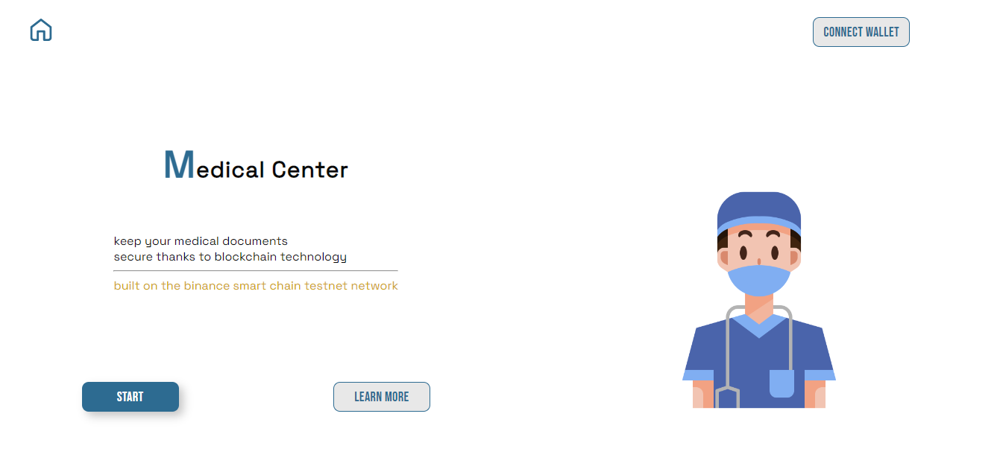
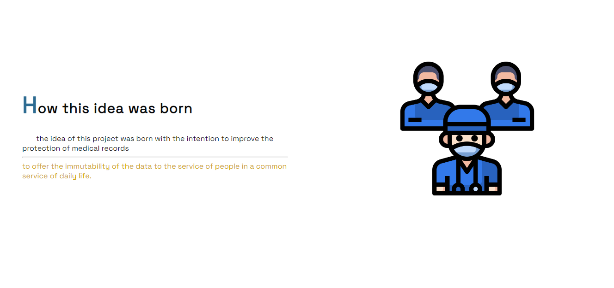
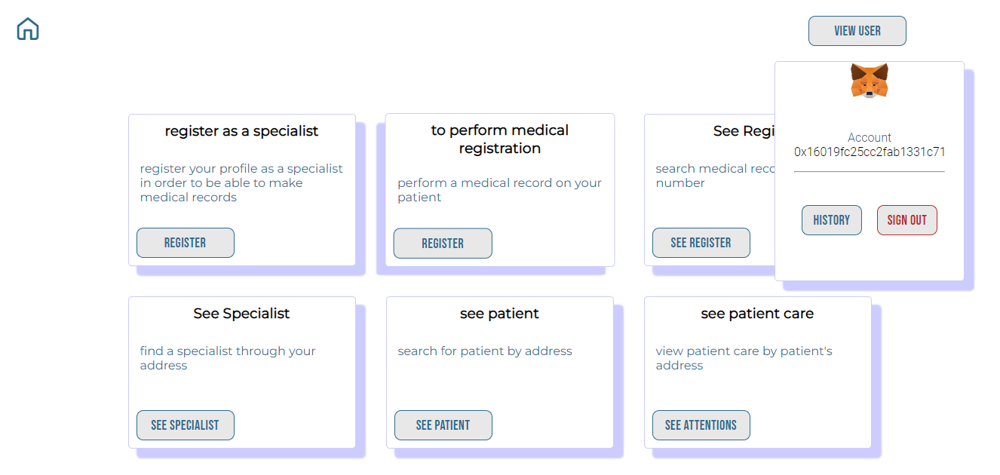
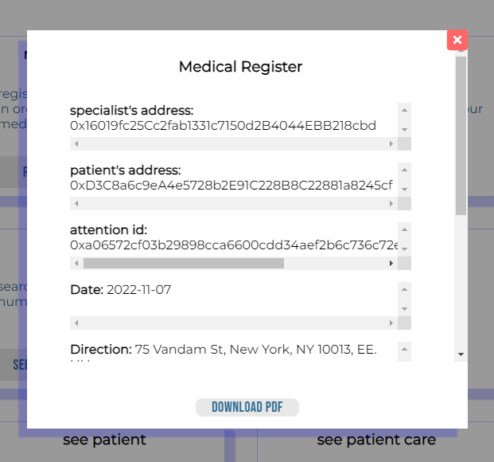
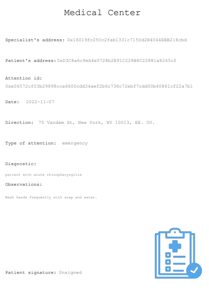

    
    <a align="center" href="" target="_blank">
       <h1 align="center">Medical Center</h1>
    </a>
  

    an application for immutable medical records built on Binance Smart Chain network.
  

   

 
 # the idea 

the idea of this project was born with the intention to improve the protection of medical records, to offer the immutability of the data to the service of people in a common service of daily life.

#  the problem 

the problem with current medical documents is that they are in danger of being lost, both in physical format, as they can be lost, and in digital format, as the databases currently used are centralized.

#  The Solution 

The solution offered by Medicalcenter is to use blockchain technology to give an extra layer of data protection to both the patient and the specialist, the patient will have his document issued by his favorite care center and can also store that record in the Medicalcenter application. 

# but where is the information stored?

medical record, patient and specialist information is stored in the smart contract

 

  

    
  

 
  

    
  

  
  # you can consult for a medical record with an identification number.
  
  

    
  

  
  # you can also download your medical record in PDF format.
  
  

    
  

# stack

javaScript, solidity, hardhat, ethers.js ,Bsc testnet, React.js, Sass, Moralis Web3, npm, Node.js, fortawesome, web3uikit, jspdf, sweetalert2

